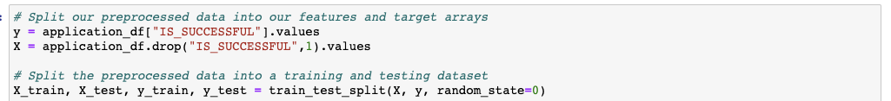
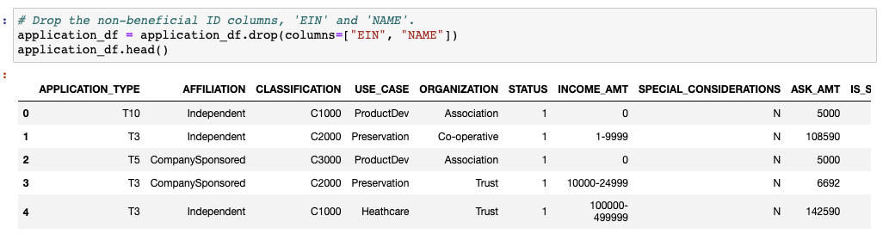
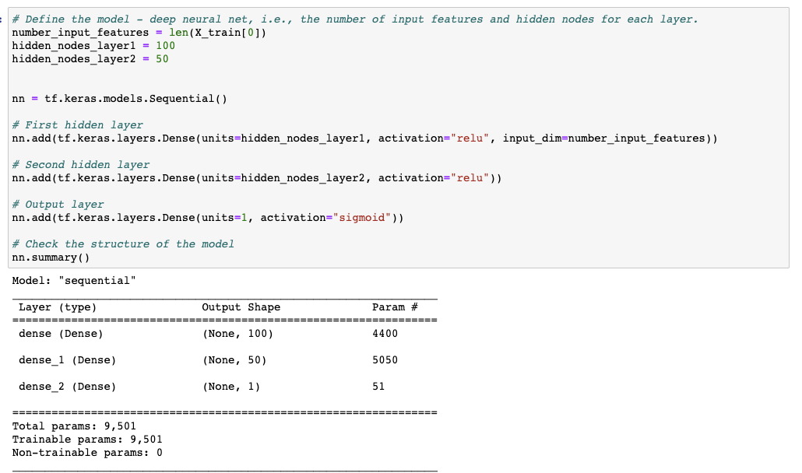
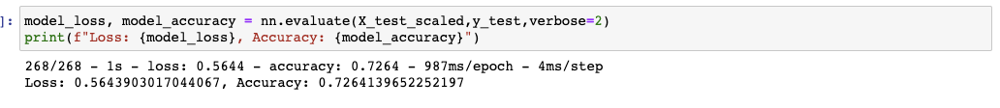

# Neural Network Charity Analysis

## Purpose

In this project we need to create a binary classifier that is capable of predicting whether applicants will be successful if funded by Alphabet Soup. We created a deep learning neural network that evaluates all types of input data and produces a decision making result using the Python TensorFlow library.

## Results

### Data Preprocessing

- The Column "IS_SUCCESSFUL" is considered target for this model.
  
- The column APPLICATION_TYPE, AFFILIATION, CLASSIFICATION, USE_CASE, ORGANIZATION, STATUS, INCOME_AMT, SPECIAL_CONSIDERATION, ASK_AMT columns are considered to be the features of model.
- The EIN and NAME columns are neither targets nor features and should be removed from the input data.
  

### Compiling, Training, and Evaluating the Model

- I selected 100 neurons with relu activation function for 1st layer, 50 neurons with relu activation function for 2nd layer and sigmoid function for ouput layer.
  
- I could achieve accuracy of 72.6 % and not the target model performance.
  
- I tried Adjusting the input data, Adding more neurons to a hidden layer, Adding more hidden layers and reducing the number of epochs to the training regimen.
  
  

## Summary

Loss - 0.564
Accuracy - 0.726

We could further also optimize our neural network by removing more features or simply adding more data to the dataset to increase accuracy. We could have used the Random Forest classifiers to improve accuracy.
